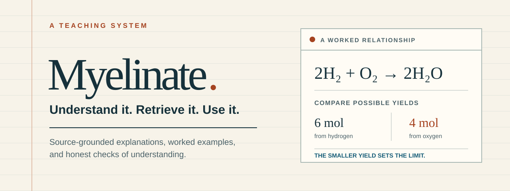

<p align="center"></p>

**An agent skill that turns “teach me this” into explanation, practice, feedback, and a reason to come back.**

Ask about a concept. Bring your course materials if you have them. Myelinate researches the topic, teaches it in manageable steps, and checks what you can do with it. It is a Markdown skill for a capable AI assistant—not a separate model or a hosted tutoring service.

[Read the skill](myelinate.md) · [Try the sample lesson](https://baney75.github.io/myelinate/examples/lesson.html) · [See the evidence](references/evidence.md)

## Start with one good question

```text
Use $myelinate to teach me limiting reactants.
I understand moles, but I keep choosing the wrong reactant.
I have 20 minutes. Explain first, then help me practice.
```

Or:

```text
Use $myelinate with my study guide and notes.
Map the tested objectives, teach my weak spots, and give me
new problems in the format my course uses.
```

The tutor asks about the goal, course context, and optional access preferences. For courses, it asks for the **study guide, syllabus, notes/slides, and textbook edition**. Missing materials do not block a first lesson. Neurodivergence disclosure is optional; “shorter steps help” is enough.

## What makes the lesson useful

| From the learner | From Myelinate |
| --- | --- |
| “I don't get it.” | A clear explanation, a worked example, and the limits of the analogy. |
| “I think I know it.” | A question you answer before seeing the solution, with specific feedback. |
| “I can do that example.” | A changed application that checks whether you can choose and use the idea. |
| “My exam is next week.” | Course-aligned practice and a realistic queue for revisiting the gaps. |
| “I need a different pace.” | Options for chunk size, steps, response format, and distractions. |
| “Make me something I can study.” | A source-linked study pack with original practice and a separate explained answer key. |

**Explain → retrieve → get feedback → apply → revisit.** The sequence adapts. You can ask for an explanation, request a hint, skip a test, or stop at any time. Flashcards are available when useful; application stays central.

## Install

### Codex

Clone this repository and link it into your skill directory (macOS/Linux):

```sh
git clone https://github.com/baney75/myelinate.git
mkdir -p "${CODEX_HOME:-$HOME/.codex}/skills"
ln -s "$PWD/myelinate" "${CODEX_HOME:-$HOME/.codex}/skills/myelinate"
```

Run the link command from the directory containing the clone. If a `myelinate` skill already exists, inspect it before replacing anything. For Windows, copy `SKILL.md`, `references/`, and `agents/` into a `myelinate` folder under your configured skills directory. Open a new chat if the client needs to refresh discovery, then use `$myelinate`.

### Other assistants

Use an environment's supported skill importer with this folder, or provide [myelinate.md](myelinate.md) as instructions. The core file is usable by itself; supply `references/` for the full research and output guidance. Browsing and file-reading tools enable current research and course-source inspection. Without them, the tutor must label its limits. Native invocation and automatic discovery vary by product; compatibility has not been tested in every assistant.

No API keys, package installation, or external service is required by the skill itself. Your assistant's ordinary access, tools, and usage limits still apply.

## See the approach

The [interactive sample](https://baney75.github.io/myelinate/examples/lesson.html) teaches limiting reactants with a worked example, a fresh numerical problem, hints, and answer feedback. It distinguishes independent, hinted, and revealed work. It does not collect responses or pretend to measure long-term retention. [Open the source](examples/lesson.html) to use it offline.

For course material, Myelinate can produce a compact scope map, concept explanation, practice set, explained answer key, and review queue. The included [templates](references/session-template.md) keep those outputs consistent without forcing every lesson into a document.

## Evidence without mythology

Retrieval, spacing, feedback, and worked examples have substantial research behind them. Their effects depend on the task, learner, timing, and comparison. The [evidence ledger](references/evidence.md) links the sources, inspected scope, and limits. The [research method](references/research-method.md) explains how the tutor evaluates sources for a new topic.

“Myelinate” is a name, not a claim that a prompt changes your myelin. This package cannot force permanent memory or guarantee a grade. A good-looking study guide is not a learning outcome. The tutor reports actual attempts and delays; the complete skill's learning efficacy has not been established.

Learner health disclosures and course records stay out of public outputs. Saving preferences or progress requires agreement. A suggested review time is not a scheduled notification.

## Improve it

Useful contributions include a reproducible tutoring failure, a better-supported source, an accessibility fix, or a clearer exercise. Use fictional or consented, de-identified examples; do not upload private course material, learner health information, or restricted exams.

```sh
python3 scripts/check.py          # package integrity and local links
python3 scripts/check.py --sync   # regenerate SKILL.md after editing myelinate.md
```

`myelinate.md` is the authored source; `SKILL.md` is an identical generated entrypoint for skill discovery. [Behavioral scenarios](evals/scenarios.md) test decisions that a syntax checker cannot. [Verification notes](evals/verification.md) describe what has actually been checked.

MIT licensed. Research and linked third-party material retain their own rights.
